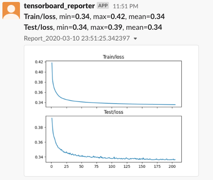

# TensorBoard Reporter

[](https://github.com/psf/black) [](https://pypi.org/project/tensorboard-reporter/)

Get reports for your training process via Slack.

## Setup

Install TensorBoard Reporter from pip

```bash
pip install tensorboard-reporter
```

Configure your report

```bash
SLACK_BOT_TOKEN="xoxb-abc-1232" tensorboard-reporter \
 --run_dir runs --all_time \
 --tag "Test/loss" --tag "Train/loss" \
 --interval_hour 0.5 --slack_channels "#tensorboard-reports"
```

And get reports to your Slack periodically



## Command line usage

```sh
usage: tensorboard-reporter [-h] --run_dir RUN_DIR --interval_hour
                            INTERVAL_HOUR --slack_channels SLACK_CHANNELS
                            [--tag TAG] [--all_time]

Get reports for your training process via Slack

optional arguments:
  -h, --help            show this help message and exit

required arguments:
  --run_dir RUN_DIR     tensorboard run dir
  --interval_hour INTERVAL_HOUR
                        report interval hour
  --slack_channels SLACK_CHANNELS
                        slack channels (comma separated) which messages will
                        be sent (can be user ids)
  --tag TAG             tags to report. Default: all tags
  --all_time            include all summaries (even old ones). Default:False
```
